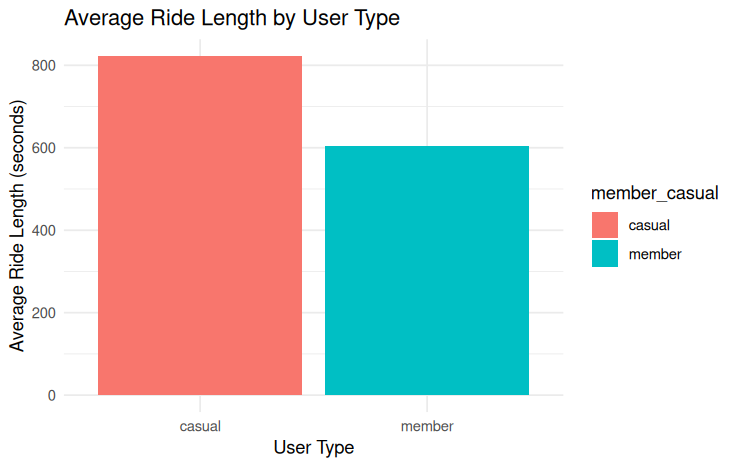

# Cyclistic-Bike-Share-Analysis
Data analysis of Cyclistic bike-share usage using R to identify behavioral differences between casual riders and members.
# 🚴 Cyclistic Bike Share Analysis

## 📌 Objective
The objective of this project is to analyze how casual riders and annual members use Cyclistic bike-share services differently. The goal is to identify behavioral patterns and provide recommendations to convert casual riders into members.

---

##  Dataset

The dataset used in this analysis is the Divvy Bike Share dataset provided for the Cyclistic case study.

Source: Divvy Bike Share  
Link: https://divvy-tripdata.s3.amazonaws.com/index.html  

This dataset is publicly available and was used for educational purposes as part of the Google Data Analytics case study.

---

##  Tools Used

- R  
- ggplot2  
- readr  

---

##  Project Workflow

### 1. Data Loading
- Loaded dataset using `read_csv()` in R.

### 2. Data Cleaning
- Converted date columns (`started_at`, `ended_at`) into proper datetime format using `as.POSIXct()`
- Removed invalid records such as:
  - Negative ride durations  
  - Extremely long rides (> 24 hours)

### 3. Feature Engineering
- Created a new column `ride_length` to calculate trip duration
- Created a `weekday` column to analyze ride patterns across days

### 4. Data Analysis
- Compared average ride duration between casual riders and members
- Analyzed ride patterns across weekdays

### 5. Data Visualization
- Created bar charts using ggplot2 to visualize differences in ride duration

---

##  Key Insights

- Casual riders have higher average ride durations compared to members  
- Casual riders are more active on weekends, especially Saturday and Sunday  
- Members show consistent usage across all days of the week  
- Casual riders tend to use bikes for leisure, while members use them for routine commuting  

---

##  Recommendations

- Offer weekend promotions to target casual riders  
- Highlight cost savings of membership for frequent users  
- Introduce flexible or short-term membership plans  
- Focus marketing campaigns on weekends when casual usage is highest  

---

##  Visualization

---

##  Future Improvements

- Extend analysis to full 12-month dataset for deeper insights  
- Perform seasonal and monthly trend analysis  
- Build interactive dashboards using Tableau or Power BI  

---

## Author
Manogna Mallapragada

Manogna Mallapragada
